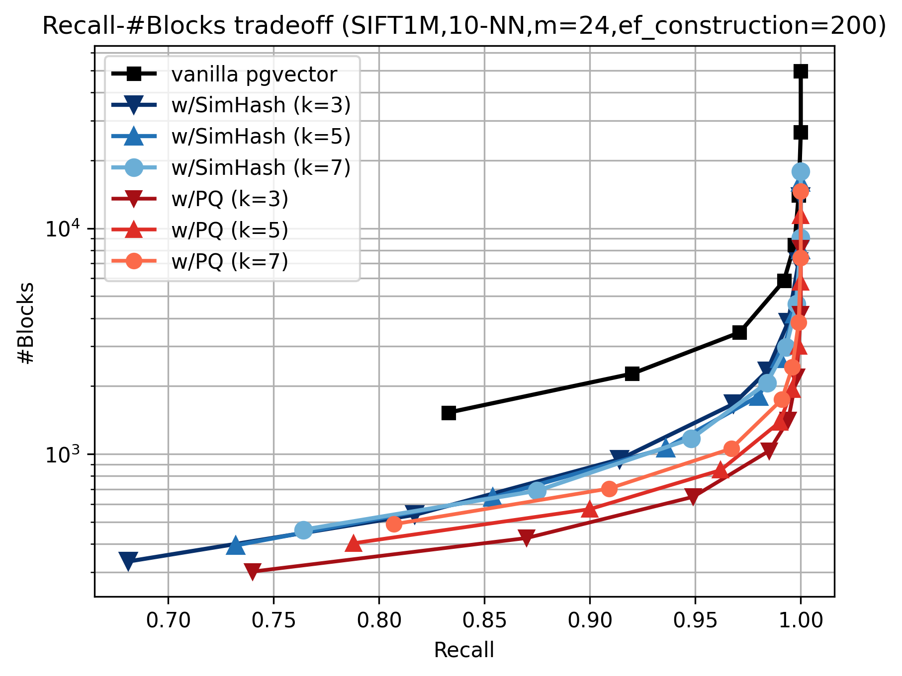

# pgvector（HNSW）を探索候補の枝刈りで改良してみた

## はじめに

[PostgreSQL Advent Calendar 2025（シリーズ2）](https://qiita.com/advent-calendar/2025/postgresql)の4日目の記事です。

本記事では、[pgvector](https://github.com/pgvector/pgvector)（今回の記事では[v0.8.0](https://github.com/pgvector/pgvector/tree/v0.8.0)の実装が前提）の[HNSW（Hierarchical Navigable Small World）](https://arxiv.org/abs/1603.09320)実装に対して探索候補の枝刈りロジックを追加することで、**参照するブロック数を最大84%削減**する方法を紹介します。
実装した最適化は、pgvector v0.8.0へのパッチとして以下のリポジトリで公開しています：
- [https://github.com/maropu/pgvector_hnsw_candidate_pruning_patch](https://github.com/maropu/pgvector_hnsw_candidate_pruning_patch)

## TL;DR

- **対象とする問題**: pgvectorのHNSWによる探索時にランダムなブロックの参照が大量に発生し、I/Oオーバーヘッドやロック競合の原因になる
  - 例えば[SIFT1M](http://corpus-texmex.irisa.fr/)のデータセットの場合、1回の探索でrecall=0.95時に約2,500ブロック（約20MiB）、recall=1.0時に約15,000ブロック（約117MiB）を平均的に参照する
  - 隣接頂点が異なるブロックに分散配置されていることが多いため、探索の各候補の距離計算に異なるブロックの参照が必要なる可能性が高い
- **試した解決策**: 最大で $2*m$ 個（$m$ はpgvectorのパラメータ）ある隣接頂点を、実際のブロックを読まずに距離を推定できるようにメタデータ（16バイト）を各頂点に埋め込み、top-k候補以外を枝刈り
- **実装した2種類の距離推定の方法**
  - **SimHash**: 隣接頂点への方向情報を96ビット（12バイト）の固定長ビットベクトルで保存し、辺長（4バイト）と合わせて余弦定理により距離を推定（学習不要、軽量）
  - **Product Quantization（PQ）**: 隣接頂点ベクトルをPQで符号化した16バイトのコードで保存し、探索時に近似ベクトルを再構築して推定距離を計算（学習必要、高精度）
- **実験結果**: SIFT1M（10-NN）でvanilla pgvecctorと比較し、1回の探索で参照するブロック数を一貫して削減（下図）
  - SimHash（青線）: recall=0.95でk=5時に69%削減、recall=1.0でk=3時に72%削減
  - PQ（赤線）: recall=0.95でk=3時に81%削減、recall=1.0でk=3時に84%削減
- **トレードオフ**: 索引サイズが約68%増加（781 MiB -> 1313 MiB）
- **今後の展望**: 索引サイズの増加を抑えるため、HNSW索引内のベクトルをPQで符号化する方式（Two-Stage PQ）も試作中
  - [https://github.com/maropu/pgvector_hnsw_two_stage_pq_patch/blob/master/DESIGNDOC.md](https://github.com/maropu/pgvector_hnsw_two_stage_pq_patch/blob/master/DESIGNDOC.md)



*図: SIFT1M（10-NN）におけるrecallと参照するブロック数のトレードオフ（m=24, ef_construction=200）*

## 問題が発生する背景

pgvectorでHNSW索引を使った近傍探索を行う際、大量のランダムなブロックの参照が発生し、性能ボトルネックとなる可能性があります。
PostgreSQLでは、データは固定サイズのブロック（デフォルトで8KiB）単位で管理されますが、この設計がグラフベースの探索と相性が良くありません。

HNSWは階層的なグラフ構造を用いた近似最近傍探索アルゴリズムで、貧欲的に最近傍を探索します。
具体的には、現在の頂点から隣接する**すべての候補頂点**との距離を計算し、クエリに最も近い隣接頂点へと反復的に移動していきます。
pgvectorは[PASE](https://dl.acm.org/doi/10.1145/3318464.3386131)の提案を参考にグラフの頂点と辺を各ブロックに配置していますが、**隣接頂点が異なるブロックに分散配置されていることが多い**ため、探索の各候補の距離計算に異なるブロックの参照が必要になる可能性が高くなります。

その結果、各隣接頂点との距離計算のために個別のブロックの参照が必要となり、頻繁なランダムI/Oが発生します。
例えば、[SIFT1M](http://corpus-texmex.irisa.fr/)のデータセットでは、1回の探索でrecall=0.95時に約2,500ブロック（約20MiB）、recall=1.0時には約15,000ブロック（約117MiB）を平均的に読み込む必要があります。
この大量のランダムなブロックの参照は、I/Oオーバーヘッドやトランザクション処理における同時実行制御によるロック競合を発生させ、全体的なクエリのスループットを低下させます。

本記事では、１回の探索で参照する必要のあるブロック数を削減する方法を紹介します。

## 試した解決策：グラフ上の探索候補の枝刈りによる最適化

### 基本アイデア

すべての隣接頂点を実際に読み込む代わりに、**各隣接頂点のメタデータ（16バイト）を現在の頂点に埋め込み**、これを使ってクエリ $q$ （探索対象のベクトル）と隣接頂点 $n$ との距離を推定します。
推定距離 $\hat{d}(q,n)$ で隣接頂点をランキングし、**上位k個の頂点を含むブロックだけを読み込んで距離を計算**します。
これは過去の研究（例えば、最近の研究だと[これ](https://arxiv.org/abs/2506.08276)とか[これ](https://www.usenix.org/conference/fast25/presentation/tian-bing)とか）でも探索のヒューリスティックな効率化の手法として良く採用されています。

具体的な実装では、pgvectorの隣接頂点のリストを管理する構造体（`HnswNeighborTupleData`）を拡張します。
元のpgvectorでは、隣接頂点は`ItemPointerData`（隣接頂点を含むブロック番号とオフセットを表現）の配列として格納されていますが、本手法では各`ItemPointerData`に16バイトのメタデータを対応付け、`(メタデータ, ItemPointer)`のペアの配列として再構成します。
これにより、隣接頂点を含むブロックを実際に読み込む前に、埋め込まれたメタデータを用いて距離の推定値を計算し、読み込むべきブロックを絞り込むことが可能になります。

```
typedef struct HnswNeighborTupleData
{
	uint8		type;
	uint8		version;
	uint16		count;
	ItemPointerData indextids[FLEXIBLE_ARRAY_MEMBER];
}			HnswNeighborTupleData;
```
隣接頂点のリストを管理する[構造体](https://github.com/pgvector/pgvector/blob/2627c5ff775ae6d7aef0c430121ccf857842d2f2/src/hnsw.h#L342-L348)

次に距離を推定する方法として[SimHash](https://dl.acm.org/doi/10.1145/509907.509965)と[Product Quantization（PQ）](https://ieeexplore.ieee.org/document/5432202)の異なる手法を用いたアプローチを紹介します。

### アプローチ1：SimHashベースの距離推定

SimHashベースの方法では、辺ベクトル $\Delta = (n - c)$（$n$ は隣接頂点ベクトルを、$c$ は現在の頂点ベクトルをそれぞれ表す）の方向情報を96ビット（12バイト）の固定長ビットベクトル（SimHash）で保存し、加えて辺の長さ $\|\Delta\|$ を32ビット（4バイト）で格納します。

探索時には、まずクエリオフセット $v = (q - c)$（$q$ はクエリベクトルを表す）のSimHash（96ビットのビットベクトル）を計算します。
次に、保存されている $\Delta$ のSimHashを $h_\Delta$、$v$ のSimHashを $h_v$ として、それらのハミング距離 $H(h_\Delta, h_v)$ を計算することで、2つのベクトル間の角度 $\hat{\theta}$ が推定できます（[$\cos(\hat{\theta}) \approx 1 - H(h_\Delta, h_v) / b$](https://dl.acm.org/doi/10.1145/509907.509965)、$b$ はSimHashのビット長で $b=96$）。
最後に、推定した角度 $\hat{\theta}$ と保存されている辺の長さ $\|\Delta\|$、計算したクエリオフセットの長さ $\|v\|$ を使い、余弦定理により推定距離を導出します。

この方法は事前の学習が不要で、わずか16バイトのメタデータで高速なハミング距離計算により軽量に推定できる点が特徴です。

### アプローチ2：Product Quantization（PQ）ベースの距離推定

PQベースの方法では、隣接ベクトル $n$（隣接頂点のベクトル）を $M$ 個の等しい長さのサブベクトルに分割します（$n = [n_1, n_2, \ldots, n_M]$）。
索引構築時に、各サブベクトルの次元空間でk-meansを用いてクラスタリングし、256個のセントロイド（代表ベクトル）を学習します。
各サブベクトル $n_j$ に対して、このセントロイドのリストから最も近いセントロイドのインデックス（0〜255）を特定し、その**1バイトのコード**として保存します。

探索時には、各サブベクトルの1バイトコードを読み取り、対応するセントロイドを取得してこれらを連結することで近似ベクトル $\tilde{n}$ を再構築します。
そして、推定距離 $\hat{d}(q,n)$ を $\hat{d}(q,n) = \| q - \tilde{n} \|$ として計算します。

この方法は、SimHashよりも精度の高い距離推定を実現できる一方で、索引構築時のセントロイドの学習に追加の計算コストが必要となります。
また学習したセントロイドのリスト（コードブック）の保存に追加の空間コストも必要になります（ただしメタデータによる追加の空間コストと比較すると相対的に小さいため無視可能）。

## ベンチマーク結果

この実験では、SIFT1M（10-NN）を用いて、vanilla pgvectorと2つの候補枝刈り実装（SimHashベースとPQベース）を比較しました。
評価指標として、目標recall達成に必要なブロックの参照数を測定し、pgvectorのHNSW実装のパラメータは`m=24`、`ef_construction=200`を使用しています。

冒頭の図が示すように、recall=0.95付近では、SimHashベースのvanilla pgvectorと比較してブロックの参照数を約52%（k=3）、69%（k=5）、66%（k=7）削減しました。
一方、PQベースの実装はより強力な削減効果を発揮し、約81%（k=3）、75%（k=5）、69%（k=7）の削減を達成しています。
recall=1.0では、SimHashベースが約72%（k=3）、68%（k=5）、64%（k=7）の削減を実現し、PQベースは約84%（k=3）、77%（k=5）、71%（k=7）の削減を達成しました。
したがって、両パッチとも精度を維持しながらブロックの参照を一貫して削減しており、特にrecallが高い領域では効果が顕著であることが示されています。

## トレードオフ（索引サイズの増加）と今後の展望

この設計の制限事項は、**隣接頂点ごとに16バイトのメタデータを追加するため、索引サイズが増加する**ことです。
SIFT1Mでは、vanilla pgvectorの索引は781 MiBを占めますが、この最適化を有効にすると両パッチとも索引サイズが1313 MiB（約+68%）になります。
この追加の空間コストへの対処は、今後の重要な課題です。

索引サイズの増加を抑えるため、HNSW索引内のベクトルをPQで符号化する方式（Two-Stage PQ）も試作中です。
この方式では、各ベクトルに対して2段階のPQによる符号化を適用します。
第1段階（Neighbor PQ）では前述の「アプローチ2」で説明したPQベースのアプローチと同様に、各ベクトルをPQで符号化して隣接頂点に埋め込みます。

第2段階（Element PQ）では元のベクトルと第1段階のPQで近似したベクトルとの差分（残差ベクトル）を計算し、これをPQ（正確には[Optimized PQ](https://ieeexplore.ieee.org/document/6619223)）で符号化したデータを索引内のベクトルと置き換えます。
探索時には、第1段階の16バイトコードから再構築したベクトルに、第2段階の残差ベクトルを加算することで、元のベクトルを近似することで計算を行います。
この設計により、各頂点埋め込んだメタデータによる追加の空間コストを、ベクトルの圧縮で相殺し、候補枝刈りの利点を保ちながら索引サイズの増加を抑制することを目指しています。

方式の詳細なデザインは以下のリポジトリで公開しています：
- [https://github.com/maropu/pgvector_hnsw_two_stage_pq_patch/blob/master/DESIGNDOC.md](https://github.com/maropu/pgvector_hnsw_two_stage_pq_patch/blob/master/DESIGNDOC.md)
